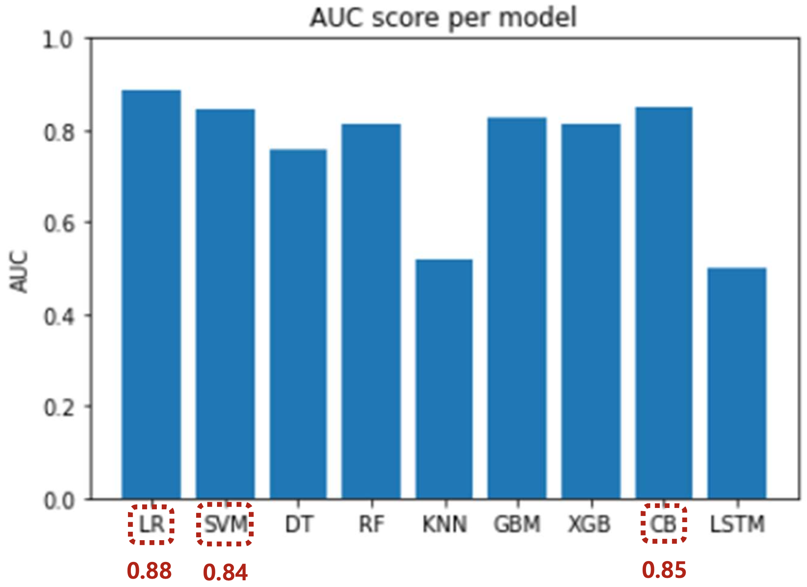
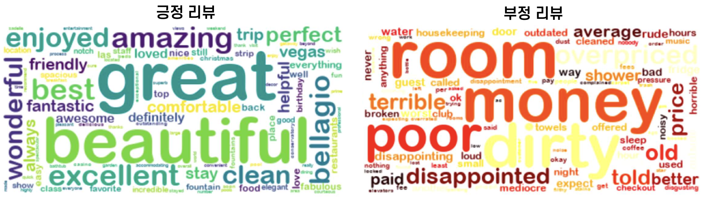

# 2022 Machine Learning Project 
호텔 리뷰에 대한 감성 분석을 통해 고객의 긍정적/부정적 피드백을 파악하고 이를 바탕으로 마케팅 활용 방안을 제시합니다.

## 수행 과정
- 웹 크롤링을 통한 리뷰 데이터 수집
    - '트립어드바이저'에서 '라스베가스 벨라지오 호텔'의 리뷰 2889개를 수집
    - 평가 점수, 제목, 리뷰 내용을 분석에 사용함
- 데이터 라벨링
    - 이진 분류를 위해 평점 4~5점 = 긍정, 1~3점 = 부정으로 라벨링
- 데이터 불균형 해결
    - 긍정 : 부정 = 2061 : 815
    - SMOTE를 활용한 oversampling 적용
- 텍스트 전처리
    - 불용어 제거 → 단어 토큰화 → TF-IDF 변환
- 모델링
    - 머신러닝 알고리즘 사용
        - Logistic regression, SVM, Decision tree, Random forest, KNN, GBM< XGboost, CatBoost, LSTM
        - Input : 리뷰의 TF-IDF 값
        - Output : 긍정/부정
          
## 감성 분석 결과
### AUC score

- 상위 3개의 모델인 Logistic regreesion, SVM, CatBoost가 각각 0.88, 0.84, 0.85의 AUC score를 달성함
### Word cloud

- 긍정 리뷰에서 'beautiful' 같은 표현을 강조해 호텔의 인테리어와 야경을 마케팅 요소로 활용할 수 있음
- 부정 리뷰에서 'dirty' 같은 표현을 식별하여 청결 문제 개선 방안을 마련하고 고객 만족도를 높일 수 있음

